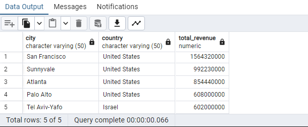
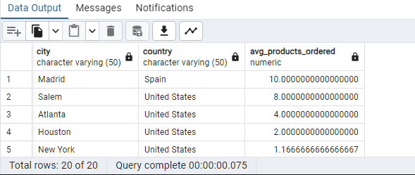
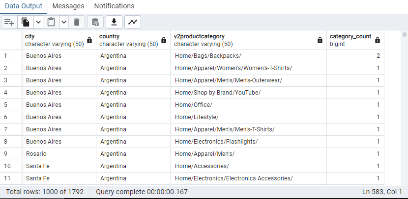
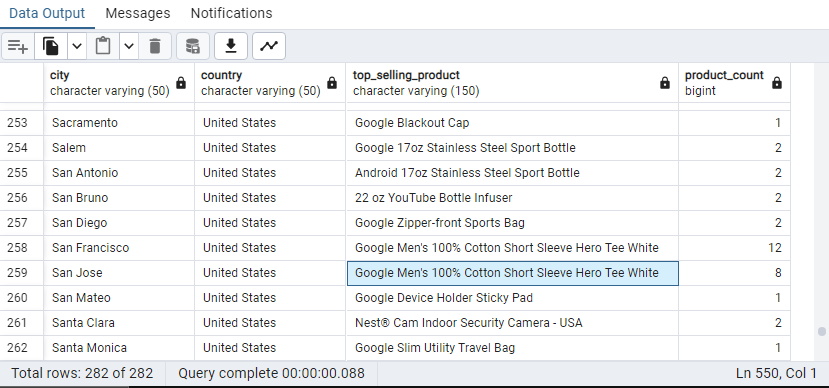
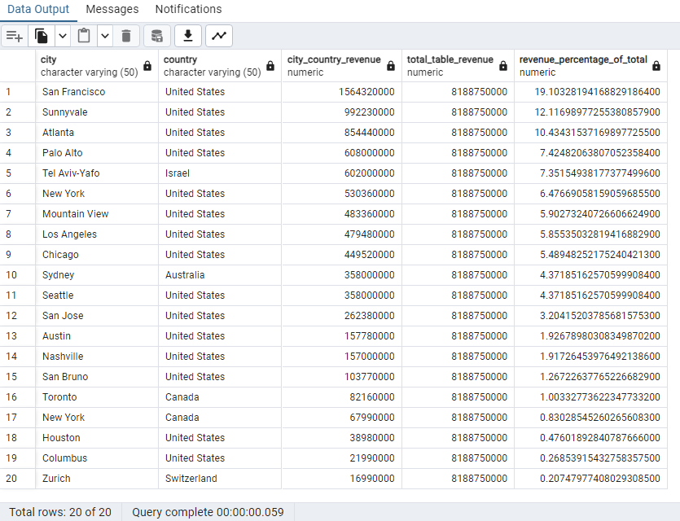

Answer the following questions and provide the SQL queries used to find the answer.

    
**Question 1: Which cities and countries have the highest level of transaction revenues on the site?**


SQL Queries:
```SQL

SELECT 
    city, 
    country, 
    SUM(total_transactionrevenue) AS total_revenue
FROM 
    all_sessions
WHERE 
    country != '(not set)'
    AND city != '(not set)'
    AND city != 'not available in demo dataset'
    AND total_transactionrevenue IS NOT NULL
GROUP BY 
    city, 
    country
ORDER BY 
    total_revenue DESC
LIMIT 5
```


Answer:


The top 4 Cities were all in the USA being; San Francisco, Sunnyvale, Atlanta and Palo Alto. The 5th city on the list was Tel Aviv in Israel




**Question 2: What is the average number of products ordered from visitors in each city and country?**


SQL Queries:
```SQL

SELECT 
city, country, AVG(product_quantity) AS avg_products_ordered
FROM all_sessions
WHERE 
    country != '(notset)'
    AND city != '(notset)'
    AND city != 'not available in demo dataset'
    AND product_quantity IS NOT NULL
GROUP BY city, country
ORDER BY avg_products_ordered DESC
```


Answer:




**Question 3: Is there any pattern in the types (product categories) of products ordered from visitors in each city and country?**


SQL Queries:


```SQL

SELECT 
city, country, v2productcategory, COUNT(*) AS category_count
FROM all_sessions
WHERE 
    country != '(not set)'
    AND city != '(not set)'
    AND city != 'not available in demo dataset'
    AND v2productcategory IS NOT NULL
	AND v2productcategory!= '(not set)'
GROUP BY city, country, v2productcategory
ORDER BY country, city, 
category_count DESC;
```


Answer:

For Most Countries Youtube,Google and Mens Tshirts were the biggest categories. In the USA Nest was also a large category




**Question 4: What is the top-selling product from each city/country? Can we find any pattern worthy of noting in the products sold?**


SQL Queries:
```SQL

WITH ranked_products AS (
    SELECT
        city,
        country,
        v2productname AS top_selling_product,
        COUNT(*) AS product_count,
        ROW_NUMBER() OVER (PARTITION BY city, country ORDER BY COUNT(*) DESC) AS rank
    FROM
        all_sessions
    WHERE
        country != '(not set)'
        AND city != '(not set)'
        AND city != 'not available in demo dataset'
        AND v2productname IS NOT NULL
    GROUP BY
        city,
        country,
        v2productname
)
SELECT
    city,
    country,
    top_selling_product,
    product_count
FROM
    ranked_products
WHERE
    rank = 1
ORDER BY
    country, city;
```


Answer:
In the USA the google Mens TeeShirt Was a top selling product in the majority of the country




**Question 5: Can we summarize the impact of revenue generated from each city/country?**

SQL Queries:
```SQL

WITH city_country_revenue AS (
    SELECT 
        city, 
        country, 
        SUM(total_transactionrevenue) AS total_revenue
    FROM 
        all_sessions
    WHERE 
        country != '(not set)'
        AND city != '(not set)'
        AND city != 'not available in demo dataset'
        AND total_transactionrevenue IS NOT NULL
    GROUP BY 
        city, 
        country
),
total_table_revenue AS (
    SELECT 
        SUM(total_transactionrevenue) AS total_revenue
    FROM 
        all_sessions
    WHERE 
        country != '(not set)'
        AND city != '(not set)'
        AND city != 'not available in demo dataset'
        AND total_transactionrevenue IS NOT NULL
)
SELECT 
    ccr.city, 
    ccr.country, 
    ccr.total_revenue AS city_country_revenue, 
    ttr.total_revenue AS total_table_revenue, 
    (ccr.total_revenue / ttr.total_revenue) * 100 AS revenue_percentage_of_total
FROM 
    city_country_revenue ccr
CROSS JOIN 
    total_table_revenue ttr
ORDER BY 
    ccr.total_revenue DESC;
```


Answer:
***Used an Online rescource in helping make the CTE

I took the Total Revenue From each city and divided it by the total Revenue to see how each city impacts the total Revenue. The top 4 countries account for nearly 50% of the total impact of Revenue




