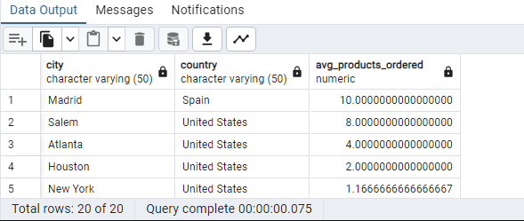
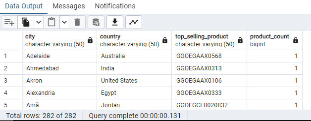
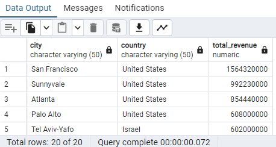

Answer the following questions and provide the SQL queries used to find the answer.

    
**Question 1: Which cities and countries have the highest level of transaction revenues on the site?**

SQL Queries:

SELECT 
    city, 
    country, 
    SUM(total_transactionrevenue) AS total_revenue
FROM 
    all_sessions
WHERE 
    country != '(not set)'
    AND city != '(not set)'
    AND city != 'not available in demo dataset'
    AND total_transactionrevenue IS NOT NULL
GROUP BY 
    city, 
    country
ORDER BY 
    total_revenue DESC
LIMIT 5

Answer:
"city"	         "country"	       "total_revenue"
"San Francisco"	 "United States"   1564320000
"Sunnyvale"	    "United States"	   992230000
"Atlanta"	    "United States"	   854440000
"Palo Alto"	    "United States"	   608000000
"Tel Aviv-Yafo"	 "Israel"	       602000000

**Question 2: What is the average number of products ordered from visitors in each city and country?**

SQL Queries:

SELECT 
city, country, AVG(product_quantity) AS avg_products_ordered
FROM all_sessions
WHERE 
    country != '(notset)'
    AND city != '(notset)'
    AND city != 'not available in demo dataset'
    AND product_quantity IS NOT NULL
GROUP BY city, country
ORDER BY avg_products_ordered DESC

Answer: 

**Question 3: Is there any pattern in the types (product categories) of products ordered from visitors in each city and country?**

SQL Queries:

SELECT 
city, country, v2productcategory, COUNT(*) AS category_count
FROM all_sessions
WHERE 
    country != '(not set)'
    AND city != '(not set)'
    AND city != 'not available in demo dataset'
    AND v2productcategory IS NOT NULL
	AND v2productcategory!= '(not set)'
GROUP BY city, country, v2productcategory
ORDER BY country, city, 
category_count DESC;

Answer:

**Question 4: What is the top-selling product from each city/country? Can we find any pattern worthy of noting in the products sold?**

SQL Queries:

WITH ranked_products AS (
    SELECT
        city,
        country,
        productsku,
        COUNT(*) AS product_count,
        ROW_NUMBER() OVER (PARTITION BY city, country ORDER BY COUNT(*) DESC) AS rank
    FROM
        all_sessions
    WHERE
        country != '(not set)'
        AND city != '(not set)'
        AND city != 'not available in demo dataset'
    GROUP BY
        city,
        country,
        productsku
)
SELECT
    city,
    country,
    productsku AS top_selling_product,
    product_count
FROM
    ranked_products
WHERE
    rank = 1;

--used online resources in the formatting of this query 
Answer:

**Question 5: Can we summarize the impact of revenue generated from each city/country?**

SQL Queries:

SELECT 
    city, 
    country, 
    SUM(total_transactionrevenue) AS total_revenue
FROM 
    all_sessions
WHERE 
    country != '(not set)'
    AND city != '(not set)'
    AND city != 'not available in demo dataset'
    AND total_transactionrevenue IS NOT NULL
GROUP BY 
    city, 
    country
ORDER BY 
    total_revenue DESC;

Answer:

